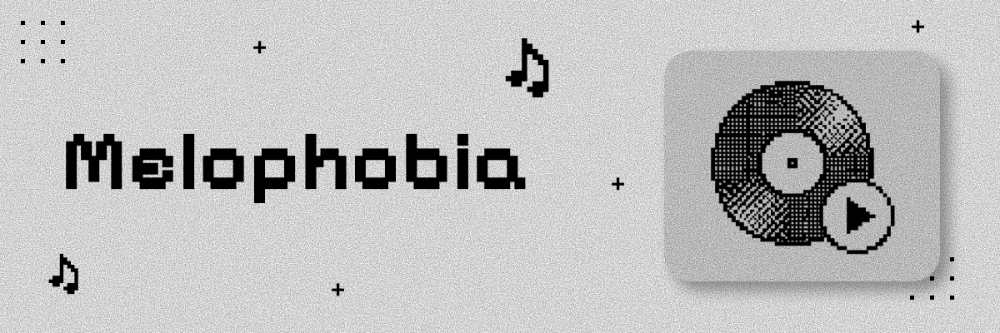

A real-time multiplayer music guessing game. Players listen to song clips together and compete to identify the track first.

---

## Table of Contents

- [About the Project](#about-the-project)
- [Key Features](#key-features)
- [System Architecture](#system-architecture)
- [Prerequisites](#prerequisites)
- [Installation and Setup](#installation-and-setup)
  - [1. Backend Setup (FastAPI)](#1-backend-setup-fastapi)
  - [2. Frontend Setup (React + Vite)](#2-frontend-setup-react--vite)
- [Environment Configuration](#environment-configuration)
- [How to Play](#how-to-play)
  - [Game Rules and Flow](#game-rules-and-flow)
  - [Scoring Rules](#scoring-rules)
- [Project Structure](#project-structure)
- [WebSocket Protocol](#websocket-protocol)
- [Troubleshooting](#troubleshooting)
- [License](#license)

---

## About the Project

Melophobia is a web game for groups of friends. 

One player creates a room. Other players join with a 6-character code. The game plays a short clip of a song. Players read four options on screen and select the correct title. 

Faster correct answers earn more points. The player with the highest total score wins the match.

---

## Key Features

- **Real-Time Multiplayer**: Players join rooms instantly with a short room code.
- **Synchronized Audio**: All players hear the same audio clip at the same time.
- **YouTube Music Integration**: The backend finds music tracks from YouTube playlists and search queries.
- **Offline Mock Fallback**: The game runs with built-in mock songs if you do not have a YouTube API key.
- **Retro Neumorphic Interface**: The visual design uses tactile buttons, vinyl record animations, and smooth waveforms.
- **Live Reactions**: Players send instant emoji reactions during the round.
- **Auto Reconnect**: Players can reconnect to an active game if their connection drops.

---

## System Architecture

The project contains two separate parts:

1. **Backend**: Built with Python and FastAPI.
   - Manages room state in memory.
   - Broadcasts real-time events through WebSockets.
   - Queries the YouTube Data API v3 for songs.
   - Calculates player points and round timers.

2. **Frontend**: Built with React 19 and Vite.
   - Renders the user interface with Tailwind CSS.
   - Plays YouTube audio through the YouTube IFrame Player API.
   - Connects to the backend via WebSocket for instant state updates.

---

## Prerequisites

Before you install the project, make sure you have:

- **Node.js**: Version 18.0.0 or higher.
- **npm**: Version 9.0.0 or higher.
- **Python**: Version 3.10 or higher.
- **Git**: Installed on your system.
- *(Optional)* **YouTube Data API v3 Key**: For live YouTube searches.

---

## Installation and Setup

Follow these steps to run Melophobia on your local machine.

### 1. Backend Setup (FastAPI)

1. Open a terminal and move into the backend folder:
   ```bash
   cd backend
   ```

2. Create a Python virtual environment:
   ```bash
   # Windows
   python -m venv venv

   # macOS and Linux
   python3 -m venv venv
   ```

3. Activate the virtual environment:
   ```bash
   # Windows (PowerShell)
   .\venv\Scripts\Activate.ps1

   # Windows (Command Prompt)
   .\venv\Scripts\activate.bat

   # macOS and Linux
   source venv/bin/activate
   ```

4. Install the backend dependencies:
   ```bash
   pip install -r requirements.txt
   ```

5. Start the FastAPI backend server:
   ```bash
   uvicorn main:app --reload --port 8000
   ```

The backend server starts at `http://localhost:8000`. You can view the API documentation at `http://localhost:8000/docs`.

---

### 2. Frontend Setup (React + Vite)

1. Open a new terminal window.
2. Go to the root directory of the project:
   ```bash
   cd Melophobia
   ```

3. Install the frontend dependencies:
   ```bash
   npm install
   ```

4. Start the Vite development server:
   ```bash
   npm run dev
   ```

5. Open your web browser and go to:
   ```text
   http://localhost:5173
   ```

---

## Environment Configuration

### Backend Configuration

Copy `backend/.env.example` to `backend/.env`:

```env
# Optional: Enter your YouTube Data API v3 key.
# If empty, the game uses built-in mock song data.
YOUTUBE_API_KEY=your_youtube_api_key_here
```

### Frontend Configuration

The frontend connects to `http://localhost:8000` by default during local development. 

For custom deployments, create a `.env` file in the project root:

```env
# URL of your deployed backend service
VITE_API_URL=https://api.yourdomain.com

# WebSocket URL of your deployed backend service
VITE_WS_URL=wss://api.yourdomain.com/ws
```

---

## How to Play

### Game Rules and Flow

1. **Host a Game**:
   - Click **Create Game**.
   - Enter your nickname.
   - Select music genres (English, Hindi, Hindi 90's, Pop, Rap, Hip-Hop).
   - Choose the number of rounds (5, 10, 15, or 20 songs).
   - Set the clip duration (10, 15, 20, or 30 seconds).
   - Click **Create Room**.

2. **Invite Friends**:
   - Share the 6-character room code or copy the room link.
   - Other players enter the room code on the **Join Game** screen.

3. **Start the Match**:
   - The host clicks **Start Game** once all players join the lobby.
   - A 3-second countdown starts before the first round.

4. **Guess the Track**:
   - Listen to the audio clip.
   - Click your answer among the 4 choices before the timer ends.
   - You can submit only one answer per round.

5. **Round Reveal and Final Results**:
   - The game reveals the correct track and player points after each round.
   - The final leaderboard shows the winner after all rounds finish.

### Scoring Rules

Points depend on accuracy and speed. Only correct answers receive points:

| Answer Position | Points Awarded |
| :--- | :--- |
| **1st Correct** (Fastest) | **1000 pts** |
| **2nd Correct** | **750 pts** |
| **3rd Correct** | **500 pts** |
| **4th Correct and later** | **250 pts** |
| **Incorrect Answer** | **0 pts** |

---

## Project Structure

```text
Melophobia/
├── backend/
│   ├── .env                    # Backend environment settings
│   ├── game.py                 # Game loop, round logic, and answer validation
│   ├── main.py                 # FastAPI application, routes, and WebSocket handler
│   ├── models.py               # Pydantic data schemas
│   ├── requirements.txt        # Python package dependencies
│   ├── rooms.py                # Room state storage and player management
│   ├── scoring.py              # Point calculation rules
│   ├── websocket_manager.py    # WebSocket connection pool and broadcasts
│   └── youtube.py              # YouTube API client and mock song library
├── src/
│   ├── components/             # Reusable UI components
│   │   ├── Countdown.jsx       # Round countdown overlay
│   │   ├── CreateGame.jsx      # Room creation screen
│   │   ├── FinalLeaderboard.jsx# Match summary and ranking screen
│   │   ├── FloatingReactions.jsx# Animated emoji overlays
│   │   ├── GamePlay.jsx        # Active round player and answer grid
│   │   ├── JoinGame.jsx        # Room code input screen
│   │   ├── Lobby.jsx           # Player waiting room
│   │   ├── PlayerList.jsx      # Connected player cards
│   │   ├── ReactionBar.jsx     # Emoji reaction picker
│   │   ├── RoundReveal.jsx     # Post-round score summary
│   │   ├── Scoreboard.jsx      # Live in-game score tracker
│   │   └── VinylIcon.jsx       # Animated vinyl record component
│   ├── constants.js            # Game settings, presets, and server URLs
│   ├── melo.css                # Custom styling, fonts, and theme rules
│   ├── Melophobia.jsx          # Main application state controller
│   └── main.jsx                # Application root entry point
├── package.json                # Frontend package configuration
├── vite.config.js              # Vite bundler configuration
└── README.md                   # Project documentation
```

---

## WebSocket Protocol

The client and server exchange JSON messages over `ws://localhost:8000/ws/{room_code}`.

### Client Messages

| Event Type | Payload Fields | Description |
| :--- | :--- | :--- |
| `join_room` | `username`, `player_id` | Join an existing room with player details. |
| `start_game` | *(none)* | Start the game (host only). |
| `submit_answer` | `round_id`, `answer_id` | Submit a guess for the active song. |
| `send_reaction` | `emoji` (`😂`, `🔥`, `🤯`, `💀`, `👏`) | Broadcast a floating emoji to all players. |
| `play_again` | *(none)* | Reset the finished game back to lobby. |

### Server Events

| Event Type | Payload Fields | Description |
| :--- | :--- | :--- |
| `room_state` | `room`, `players`, `player_id` | Full current room and player list data. |
| `player_joined` | `player`, `players` | Notifies that a new player entered the lobby. |
| `game_starting`| `countdown` | Starts the 3-second match intro countdown. |
| `round_started`| `round_id`, `options`, `duration_seconds`, `youtube_video_id` | Starts a new music guess round. |
| `round_reveal` | `song`, `answers`, `scores`, `correct_answer_id` | Shows correct answer and awarded points. |
| `game_finished`| `leaderboard`, `final_scores` | Displays final match standings. |
| `error` | `message` | Sends an error notification to the client. |

---

## Troubleshooting

### 1. Audio Does Not Play Automatically
- Web browsers block autoplay until a user interacts with the page.
- Click anywhere on the game screen to enable browser audio permissions.

### 2. WebSocket Fails to Connect
- Ensure the FastAPI backend server is active on port `8000`.
- Verify that your firewall allows connections on ports `8000` and `5173`.
- In development, Vite automatically proxies `/ws` requests to `localhost:8000`.

### 3. YouTube API Quota Exceeded
- If your YouTube API daily quota finishes, the backend logs an error.
- Remove `YOUTUBE_API_KEY` from `backend/.env` or leave it blank.
- The game will automatically switch to built-in mock song data.

---

## License

This project is licensed under the MIT License.